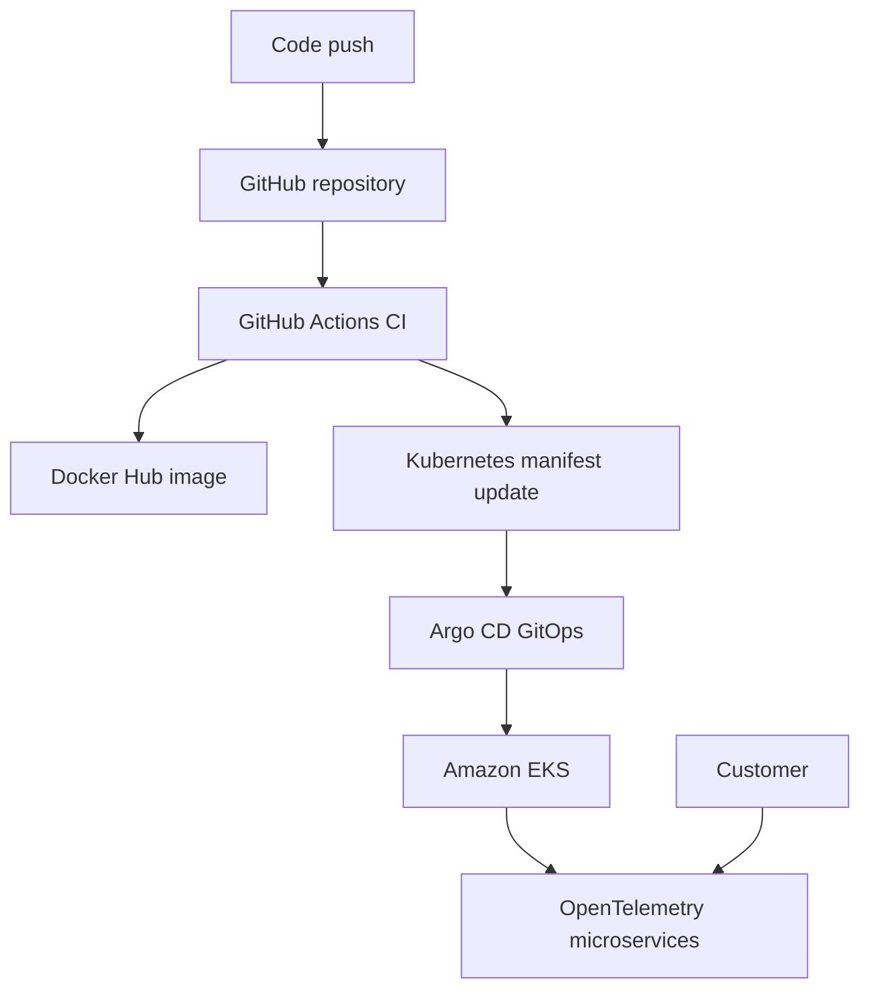

# AWS EKS GitOps E-Commerce Platform

A production-style DevOps project deploying the OpenTelemetry Astronomy Shop microservices application to Amazon EKS using Terraform, Docker, Kubernetes, GitHub Actions, and Argo CD.

This project demonstrates infrastructure as code, container CI, Kubernetes deployment, GitOps-based continuous delivery, troubleshooting, and end-to-end application validation.

> **Project status:** Successfully deployed and tested. The AWS infrastructure was later destroyed to prevent ongoing cloud charges. All reusable configuration remains in this repository.

## Project Highlights

- Provisioned a custom AWS VPC and Amazon EKS cluster using modular Terraform.
- Deployed a distributed e-commerce application composed of multiple microservices.
- Implemented a GitHub Actions CI pipeline for the Product Catalog service.
- Built and published a versioned Docker image to Docker Hub.
- Automatically updated the Kubernetes deployment manifest with the new image tag.
- Configured Argo CD for automated GitOps synchronization and self-healing.
- Diagnosed Kubernetes networking, pod scheduling, service routing, and gRPC connectivity issues.
- Successfully validated the complete shopping and checkout journey.
- Safely destroyed the cloud infrastructure after testing to control AWS costs.

## Architecture



## Technology Stack

| Area | Technologies |
|---|---|
| Cloud | AWS, Amazon EKS, VPC, IAM |
| Infrastructure as Code | Terraform |
| Containers | Docker, Docker Hub |
| Orchestration | Kubernetes |
| Continuous Integration | GitHub Actions |
| Continuous Delivery | Argo CD, Argo CD, GitOps |
| Application | OpenTelemetry Astronomy Shop microservices |
| Troubleshooting | kubectl, logs, events, Services and Endpoints |
| Version Control | Git and GitHub |

## CI/CD and GitOps Workflow

1. Code is pushed to the GitHub repository.
2. GitHub Actions validates and builds the Product Catalog service.
3. The pipeline builds a Docker image.
4. The image is pushed to Docker Hub with a unique build tag.
5. GitHub Actions updates the Kubernetes deployment manifest.
6. Argo CD detects the Git change.
7. Argo CD synchronizes the desired configuration to Amazon EKS.
8. Kubernetes performs the application rollout.
9. The application is tested through the frontend checkout workflow.

Published Product Catalog image:

```text
sugunamc/product-catalog:33811286729
```

- [GitHub Actions workflow](.github/workflows/ci.yaml)
- [Docker Hub repository](https://hub.docker.com/r/sugunamc/product-catalog)
- [Product Catalog Kubernetes manifests](kubernetes/productcatalog)
- [Argo CD Application manifest](argocd/product-catalog-application.yaml)

## Infrastructure as Code

The AWS infrastructure is defined in [`infrastructure/terraform`](infrastructure/terraform).

The Terraform configuration includes:

- Reusable VPC module
- Public and private subnets
- Amazon EKS control plane
- EKS worker-node configuration
- IAM roles and policies
- Terraform remote-state backend configuration
- S3 state storage and DynamoDB state locking

The configuration was checked using:

```bash
terraform fmt -check -recursive
terraform init -backend=false
terraform validate
```

Terraform validation completed successfully.

> The live infrastructure and remote backend were deleted after the demonstration. The Terraform configuration remains available as a reusable infrastructure blueprint.

## Kubernetes and GitOps

Kubernetes manifests are stored under [`kubernetes`](kubernetes).

Argo CD was configured with:

- GitHub as the source of truth
- Automatic synchronization
- Self-healing enabled
- Kubernetes manifests from `kubernetes/productcatalog`
- Deployment to the `default` namespace

The declarative Argo CD configuration is stored at:

```text
argocd/product-catalog-application.yaml
```

## Troubleshooting Case Study

During deployment, the frontend loaded but the product cards were missing.

### Symptoms

- The Product Catalog pod was running.
- Kubernetes Service and Endpoint objects existed.
- The frontend returned a gRPC connection error.
- The application could not connect to the Product Catalog service.

### Investigation

I examined the deployment using:

```bash
kubectl get pods
kubectl get events
kubectl logs
kubectl get services
kubectl get endpoints
kubectl rollout status
```

The Product Catalog logs showed that its gRPC server was listening on port `8088`, while the Kubernetes Service was forwarding traffic to port `8080`.

### Root Cause

```text
Service targetPort: 8080
Container listening port: 8088
```


The Product Catalog Service was corrected to use:

```yaml
targetPort: 8088
```

The fix was committed to GitHub. Argo CD detected the change and synchronized it to the cluster. Product images then appeared, and the complete checkout flow worked successfully.

I also diagnosed temporary `FailedCreatePodSandbox` events caused by AWS CNI IP allocation and single-node pod-capacity constraints.

## Validation

The following functionality was successfully verified:

- Product Catalog pod running with the CI-generated Docker image
- Argo CD application showing Healthy and Synced
- Product images displayed through the frontend
- Product selection and cart functionality
- Checkout workflow across multiple microservices
- Final “Your order is complete!” confirmation
- Terraform configuration validation
- AWS infrastructure destruction
- Removal of the Terraform S3 state bucket and DynamoDB lock table

Project screenshots will be stored under [`docs/evidence`](docs/evidence).

## Repository Structure

```text
├── .github/workflows/                 # GitHub Actions CI pipeline
├── argocd/                            # Argo CD Application manifest
├── infrastructure/terraform/          # AWS VPC and EKS Terraform code
├── kubernetes/                        # Kubernetes manifests
├── src/                               # Application microservices
├── docs/evidence/                     # Deployment evidence
└── docs/UPSTREAM_README.md             # Original project documentation
```

## Security and Cost Management

- AWS credentials and application secrets are not stored in this repository.
- Terraform state files and variable files are excluded through `.gitignore`.
- Infrastructure was destroyed after successful testing.
- The EKS cluster, networking resources, NAT Gateway, S3 state bucket, and DynamoDB lock table were verified as deleted.

## Key Learning Outcomes

This project provided practical experience with:

- Building reusable AWS infrastructure using Terraform modules
- Managing container images through an automated CI pipeline
- Deploying and troubleshooting microservices on Kubernetes
- Implementing GitOps continuous delivery with Argo CD
- Investigating failures through logs, events, Services, and Endpoints
- Correcting configuration at the Git source of truth
- Validating a complete distributed application workflow
- Managing cloud resources responsibly to avoid unnecessary costs

## Attribution

The application source is based on the open-source [OpenTelemetry Demo](https://github.com/open-telemetry/opentelemetry-demo), maintained by the OpenTelemetry community.

The AWS infrastructure, Product Catalog CI workflow, Kubernetes deployment changes, Argo CD GitOps configuration, deployment validation, and troubleshooting documented in this fork were completed as part of my DevOps portfolio implementation.

The original project README is preserved at [`docs/UPSTREAM_README.md`](docs/UPSTREAM_README.md).

## Author

**Suguna**

- GitHub: [Suguna1802](https://github.com/Suguna1802)
- Docker Hub: [sugunamc](https://hub.docker.com/u/sugunamc)


